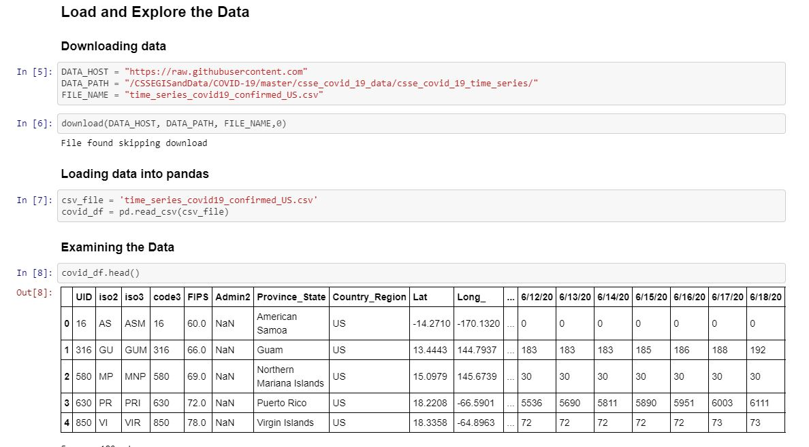

# Machine Learning Engineer Nanodegree
## Capstone Project
Ashraf Hussain 
June 22th, 2020

Machine Learning Engineer Nanodegree: Forecasting COVID-19 Cases – A Time Series Forecasting Model

## I. Definition

### Project Overview

On December 31, 2019, the World Health Organization (WHO) was informed of an outbreak of “pneumonia of unknown cause” detected in Wuhan City, Hubei Province, China. Identified as coronavirus disease 2019, it quickly came
to be known as COVID-19 and has resulted in an ongoing global pandemic. As
of 20 June 2020, more than 8.74 million cases have been reported across
188 countries and territories, resulting in more than 462,000 deaths. More
than 4.31 million people have recovered.[^1]

In response to this ongoing public health emergency, Johns Hopkins
University (JHU), a private research university in Maryland, USA,
developed an interactive web-based dashboard hosted by their Center for
Systems Science and Engineering (CSSE). The dashboard visualizes and
tracks reported cases in real-time, illustrating the location and number
of confirmed COVID-19 cases, deaths and recoveries for all affected
countries. It is used by researchers, public health authorities, news
agencies and the general public. All the data collected and displayed is
made freely available in a [GitHub
repository](https://github.com/CSSEGISandData/COVID-19/tree/master/csse_covid_19_data).

I was going to use going to use [DeepAR by AWS]([https://docs.aws.amazon.com/sagemaker/latest/dg/deepar.html](https://docs.aws.amazon.com/sagemaker/latest/dg/deepar.html)) and compare it to  AR (autoregressive model). After exploring the data the data I discovered that this data set can not be used for any Time Series Forecasting Model(TSFMs) or any other ML models. 

I was going resubmit my proposal to do another project however I realized that in real world we are given data-sets that we do not have any central over and we have to explore if that data-set is a good  candidate for ML.

In this report I will demonstrate why came to this conclusion.

### Problem Statement
This project seeks to forecast number of people infected and number of
caused by COVID-19 for a time duration of 14-days based on
historical data from JHU. I will be using Amazon SageMaker DeepAR
forecasting algorithm, a supervised learning algorithm for forecasting
scalar (one-dimensional) time series using recurrent neural networks (RNN)
to produce both point and probabilistic forecasts[^2].
DeepAR is an underutilized approach in this area.[^3] The dataset contains
hundreds of related time series, and DeepAR outperforms classical
forecasting methods including but not limited to autoregressive integrated
moving average (ARIMA), exponential smoothing (ETS), Time Series
Forecasting with Linear Learner for this type of applications.

### Metrics
The reasons why this data set could be used to predict us any of the Time Series Forecasting Model(TSFMs) because it failed the following:
**Stationarity**: FAILED
For us to use any of the above menting TSFMs our time-series, We need to first Identfy if the given time-series is  `Stationarity`

For a time-series to be Stationarity, the following do not change over time

1.  mean(μ)
2.  standard deviation(σ)
3.  Autocorrelation structure (No seasonality)

for more info see  [Stationarity](https://www.itl.nist.gov/div898/handbook/pmc/section4/pmc442.htm)

**ACF & PACF**: FAILED

## II. Analysis
_(approx. 2-4 pages)_

### Data Exploration
The datasets are accessed from files provided by the JHU GitHub
repository [time_series_covid19_confirmed_US.csv](https://github.com/CSSEGISandData/COVID-19/blob/master/csse_covid_19_data/csse_covid_19_time_series/time_series_covid19_confirmed_US.csv)

The file have the same columns:
* UID - UID = 840 (country code3) + 000XX (state FIPS code). Ranging from
8400001 to 84000056.
* iso2- Officially assigned country code identifiers 2 Chr (US, CA, ...)
* iso3 - Officially assigned country code identifiers 3 Chr.(USA, CAN,
...)
* code3- country code USA = 840
* FIPS -Federal Information Processing Standards code that uniquely
identifies counties within the USA.
* admin2 - County name. US only.
* Province_State - The name of the State within the USA.
* Country_Region - The name of the Country (US).
* Combined_Key - Province_State + Country_Region
* Population - Population
* Number of cases are is columns where each column is a day

**Step 1: Load and Explore the Data**

### Exploratory Visualization
In this section, you will need to provide some form of visualization that summarizes or extracts a relevant characteristic or feature about the data. The visualization should adequately support the data being used. Discuss why this visualization was chosen and how it is relevant. Questions to ask yourself when writing this section:
- _Have you visualized a relevant characteristic or feature about the dataset or input data?_
- _Is the visualization thoroughly analyzed and discussed?_
- _If a plot is provided, are the axes, title, and datum clearly defined?_

### Algorithms and Techniques
In this section, you will need to discuss the algorithms and techniques you intend to use for solving the problem. You should justify the use of each one based on the characteristics of the problem and the problem domain. Questions to ask yourself when writing this section:
- _Are the algorithms you will use, including any default variables/parameters in the project clearly defined?_
- _Are the techniques to be used thoroughly discussed and justified?_
- _Is it made clear how the input data or datasets will be handled by the algorithms and techniques chosen?_

### Benchmark
In this section, you will need to provide a clearly defined benchmark result or threshold for comparing across performances obtained by your solution. The reasoning behind the benchmark (in the case where it is not an established result) should be discussed. Questions to ask yourself when writing this section:
- _Has some result or value been provided that acts as a benchmark for measuring performance?_
- _Is it clear how this result or value was obtained (whether by data or by hypothesis)?_

## III. Methodology
_(approx. 3-5 pages)_

### Data Preprocessing
In this section, all of your preprocessing steps will need to be clearly documented, if any were necessary. From the previous section, any of the abnormalities or characteristics that you identified about the dataset will be addressed and corrected here. Questions to ask yourself when writing this section:
- _If the algorithms chosen require preprocessing steps like feature selection or feature transformations, have they been properly documented?_
- _Based on the **Data Exploration** section, if there were abnormalities or characteristics that needed to be addressed, have they been properly corrected?_
- _If no preprocessing is needed, has it been made clear why?_

### Implementation
In this section, the process for which metrics, algorithms, and techniques that you implemented for the given data will need to be clearly documented. It should be abundantly clear how the implementation was carried out, and discussion should be made regarding any complications that occurred during this process. Questions to ask yourself when writing this section:
- _Is it made clear how the algorithms and techniques were implemented with the given datasets or input data?_
- _Were there any complications with the original metrics or techniques that required changing prior to acquiring a solution?_
- _Was there any part of the coding process (e.g., writing complicated functions) that should be documented?_

### Refinement
In this section, you will need to discuss the process of improvement you made upon the algorithms and techniques you used in your implementation. For example, adjusting parameters for certain models to acquire improved solutions would fall under the refinement category. Your initial and final solutions should be reported, as well as any significant intermediate results as necessary. Questions to ask yourself when writing this section:
- _Has an initial solution been found and clearly reported?_
- _Is the process of improvement clearly documented, such as what techniques were used?_
- _Are intermediate and final solutions clearly reported as the process is improved?_

## IV. Results
_(approx. 2-3 pages)_

### Model Evaluation and Validation
In this section, the final model and any supporting qualities should be evaluated in detail. It should be clear how the final model was derived and why this model was chosen. In addition, some type of analysis should be used to validate the robustness of this model and its solution, such as manipulating the input data or environment to see how the model’s solution is affected (this is called sensitivity analysis). Questions to ask yourself when writing this section:
- _Is the final model reasonable and aligning with solution expectations? Are the final parameters of the model appropriate?_
- _Has the final model been tested with various inputs to evaluate whether the model generalizes well to unseen data?_
- _Is the model robust enough for the problem? Do small perturbations (changes) in training data or the input space greatly affect the results?_
- _Can results found from the model be trusted?_

### Justification
In this section, your model’s final solution and its results should be compared to the benchmark you established earlier in the project using some type of statistical analysis. You should also justify whether these results and the solution are significant enough to have solved the problem posed in the project. Questions to ask yourself when writing this section:
- _Are the final results found stronger than the benchmark result reported earlier?_
- _Have you thoroughly analyzed and discussed the final solution?_
- _Is the final solution significant enough to have solved the problem?_

## V. Conclusion
_(approx. 1-2 pages)_

### Free-Form Visualization
In this section, you will need to provide some form of visualization that emphasizes an important quality about the project. It is much more free-form, but should reasonably support a significant result or characteristic about the problem that you want to discuss. Questions to ask yourself when writing this section:
- _Have you visualized a relevant or important quality about the problem, dataset, input data, or results?_
- _Is the visualization thoroughly analyzed and discussed?_
- _If a plot is provided, are the axes, title, and datum clearly defined?_

### Reflection
In this section, you will summarize the entire end-to-end problem solution and discuss one or two particular aspects of the project you found interesting or difficult. You are expected to reflect on the project as a whole to show that you have a firm understanding of the entire process employed in your work. Questions to ask yourself when writing this section:
- _Have you thoroughly summarized the entire process you used for this project?_
- _Were there any interesting aspects of the project?_
- _Were there any difficult aspects of the project?_
- _Does the final model and solution fit your expectations for the problem, and should it be used in a general setting to solve these types of problems?_

### Improvement
In this section, you will need to provide discussion as to how one aspect of the implementation you designed could be improved. As an example, consider ways your implementation can be made more general, and what would need to be modified. You do not need to make this improvement, but the potential solutions resulting from these changes are considered and compared/contrasted to your current solution. Questions to ask yourself when writing this section:
- _Are there further improvements that could be made on the algorithms or techniques you used in this project?_
- _Were there algorithms or techniques you researched that you did not know how to implement, but would consider using if you knew how?_
- _If you used your final solution as the new benchmark, do you think an even better solution exists?_

-----------

**Before submitting, ask yourself. . .**

- Does the project report you’ve written follow a well-organized structure similar to that of the project template?
- Is each section (particularly **Analysis** and **Methodology**) written in a clear, concise and specific fashion? Are there any ambiguous terms or phrases that need clarification?
- Would the intended audience of your project be able to understand your analysis, methods, and results?
- Have you properly proof-read your project report to assure there are minimal grammatical and spelling mistakes?
- Are all the resources used for this project correctly cited and referenced?
- Is the code that implements your solution easily readable and properly commented?
- Does the code execute without error and produce results similar to those reported?

<!--stackedit_data:
eyJoaXN0b3J5IjpbLTkwODk0NTQzNSwtNzcwOTA0ODM1XX0=
-->